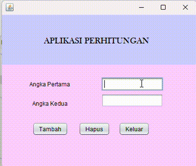

# Aplikasi Perhitungan Angka

Aplikasi Perhitungan Angka adalah aplikasi berbasis Java yang memungkinkan pengguna melakukan operasi penjumlahan pada dua angka yang dimasukkan. Aplikasi ini memiliki antarmuka yang sederhana dan mudah digunakan serta memvalidasi input agar hanya menerima angka.

## Keunggulan Aplikasi

- **Validasi Input**: Menerima input angka saja untuk mencegah kesalahan dalam perhitungan.
- **Penjumlahan**: Menghitung jumlah dari dua angka yang dimasukkan oleh pengguna.
- **Antarmuka yang Mudah**: Antarmuka berbasis Java Swing yang sederhana dan intuitif.

## Pembuat Aplikasi

Salsa Alya Istiqamah - 2210010089 - Latihan 1

## Fitur

Aplikasi Perhitungan Angka menawarkan fitur-fitur berikut:

1. **Penjumlahan Angka**  
   Memungkinkan pengguna untuk menghitung hasil penjumlahan dari dua angka yang dimasukkan pada kolom input.

2. **Validasi Input Angka**  
   Hanya menerima input berupa angka dan memberikan notifikasi error jika pengguna mencoba memasukkan karakter non-angka.

3. **Penghapusan Input**  
   Tombol "Hapus" untuk mengosongkan kolom input dan memulai perhitungan baru.

4. **Konfirmasi Keluar**  
   Tombol "Keluar" disertai dengan konfirmasi untuk memastikan pengguna sebelum menutup aplikasi.

5. **Antarmuka Pengguna yang Ramah**  
   Dibangun dengan Java Swing, aplikasi ini menyajikan antarmuka sederhana yang memudahkan pengguna untuk memasukkan angka dan menjalankan operasi.

## Cara Menjalankan

1. Clone atau unduh repositori ini ke komputer Anda.
2. Buka proyek di IDE pilihan Anda (misalnya, NetBeans, IntelliJ, atau Eclipse).
3. Pastikan JDK telah dikonfigurasi dengan benar di IDE Anda.
4. Jalankan `Latihan1` untuk memulai aplikasi.

## Demo

